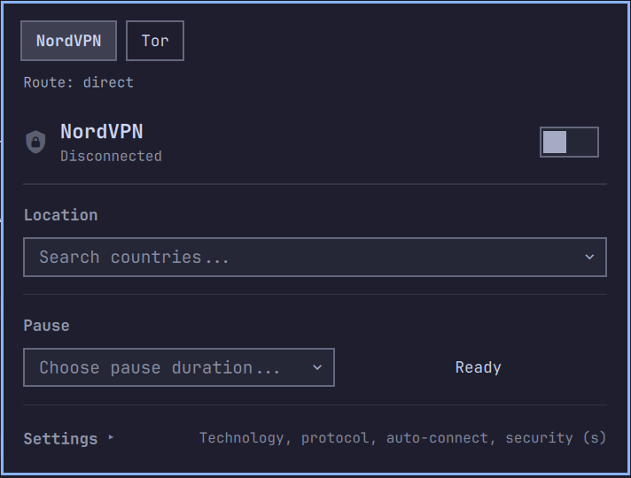
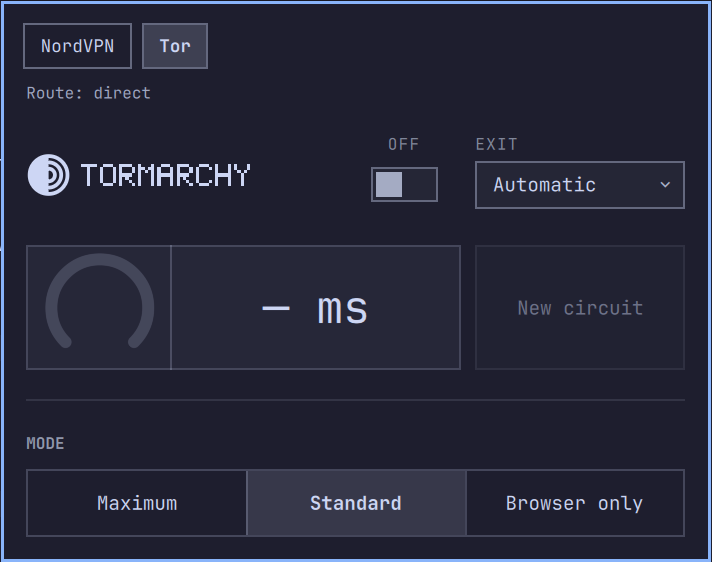

# Privacy Route for Omarchy

NordVPN and Tor behind one Omarchy bar icon, with only one of them carrying your traffic at a time.

Starting a route takes the other one down first, waits until its firewall rules are gone, and then connects. If both end up on anyway, the panel says so and lets you pick which one to keep.

<p>
  
  
</p>

## Routes

| Tab | What it does |
| --- | --- |
| **NordVPN** | Connect or disconnect, pick a country and city, pause for a while, and change technology, protocol, auto-connect, firewall, kill switch and Threat Protection Lite |
| **Tor** | Route traffic through Tor in one of three modes, get a new circuit, pin the exit country, and watch live latency through the circuit |

Tor's modes:

| Mode | Traffic through Tor |
| --- | --- |
| **Maximum** | Every packet. The local network is dropped too. |
| **Standard** | All internet traffic. The local network stays reachable. |
| **Browser only** | Nothing system-wide. Apps that speak SOCKS can use `127.0.0.1:9050`. |

Browser only doesn't reroute anything, so it can run next to NordVPN.

The panel opens on whichever route is carrying traffic.

## The bar icon

| Icon | Meaning |
| --- | --- |
| Shield with a lock | NordVPN is connected |
| Onion | Tor is on |
| Dimmed crossed-out shield | Direct, no route |
| Pulsing | Connecting, bootstrapping or switching |
| Urgent colour | Both routes are on, or a switch failed |

Hover the icon for the current route, country and Tor exit.

## Requirements

- [Omarchy](https://omarchy.org/)
- For the NordVPN tab: the [NordVPN Linux app](https://nordvpn.com/download/linux/), signed in (`nordvpn login`)
- For the Tor tab: nothing beforehand. Its one-time setup installs `tor` (see below).

## Install

```bash
omarchy plugin add https://github.com/design-nexus/omarchy-privacy-route.git --enable
```

`--enable` adds the icon to the bar. To move it:

```bash
omarchy bar move design-nexus.privacy-route --section right
```

### Tor setup

The Tor tab needs a one-time system setup. It installs `tor`, the `tormarchy` helper and a polkit rule, so the panel can connect and disconnect without a password prompt. Open the Tor tab and choose setup; it runs this in a terminal:

```bash
sudo ~/.config/omarchy/plugins/design-nexus.privacy-route/pages/tor/tormarchy setup
```

## Use

| Input | Action |
| --- | --- |
| Left-click | Open or close the panel |
| Right-click | Disconnect, or reconnect the last route used when direct |
| Middle-click | Refresh both routes |
| `Alt+1` / `Alt+2` | NordVPN / Tor tab |
| `Ctrl+Tab` | Switch tab |

**Go direct** at the top of the panel disconnects both routes.

If NordVPN's kill switch is on when you start Tor, the panel warns that it can block Tor and offers to turn it off.

### From a script or keybinding

```bash
omarchy-shell design-nexus.privacy-route route tor    # off, nord, tor
omarchy-shell design-nexus.privacy-route status
omarchy-shell design-nexus.privacy-route toggle
```

`open`, `close`, `page <nord|tor>`, `current` and `refresh` are also available.

### Tor from the terminal

The helper installed by setup has more than the panel shows:

```bash
tormarchy browser   # launch a browser that can reach nothing but Tor
tormarchy bridge on # use bridges where Tor is blocked
tormarchy doctor    # leak checks
tormarchy boot enable  # reconnect at boot if Tor was on
tormarchy panic     # remove every rule
```

Run `tormarchy help` for the full list.

## Update or remove

```bash
omarchy plugin update design-nexus.privacy-route
omarchy plugin remove design-nexus.privacy-route
```

To remove the Tor system side as well, run `sudo tormarchy uninstall` first (`--purge` also removes the `tor` package and its settings).

## License

[MIT](LICENSE). The tabs are modified copies of MIT-licensed Omarchy plugins; see [THIRD_PARTY_NOTICES.md](THIRD_PARTY_NOTICES.md) for their authors.
